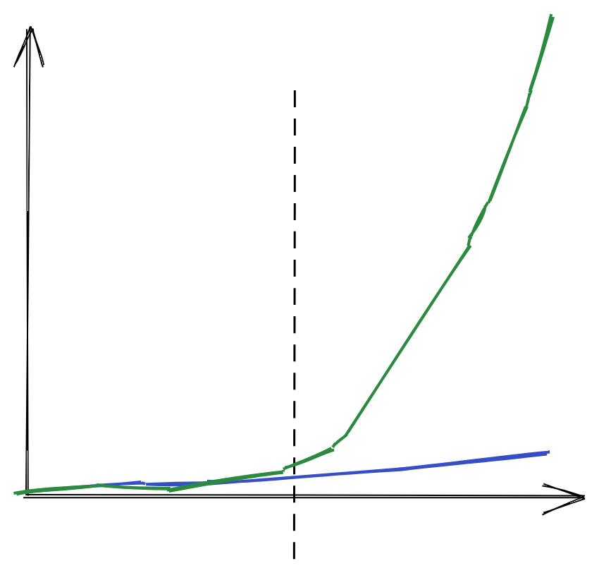

# A common failure mode for young founders

I've started to see patterns when talking to my friends. These people are super sharp, and typically have really high opportunity cost. They can build stuff really well, product, engineer, design, you name it.

Some of my friends even work on their ideas for a couple of years, raising money, only to shut down after a while (commonly before this they pivot in circles a bunch.) What gives?

Some common explanations of their failure would sound like:

- They failed because they weren't able to build something that peopl e wanted.
- They failed because they weren't able to achieve scalable growth.
- They failed because they didn't reach product-market fit.
- They failed because they weren't solving a problem that people really had. 

(These are all similar ways of saying similar things.) These reasons are correct but incomplete. 

Well, there's sort of a dichotomy going on with start-up ideas. You're basically hoping to find a market (a problem) that's worth solving. So one way to try to find a market is to try a lot of things out. Time-box (as Garry Tan says), and if your idea doesn't work out, kill it and move on. 

However, this idea always didn't completely make sense to me. Because there are a lot of startups that won't work without putting a lot of effort into understanding the specific market or building a great product. There are a ton of companies who took years to launch, or didn't receive traction until they'd been working on the idea for a long time. 

Notion took years to get their product to a place where it actually took off. I could imagine if we told Notion founders to "time-box" their idea, they could have given up before they got the product to a place that could satisfy their desired market. Other examples which are similar but not the same include Figma, which took years to launch. How can you time-box that?

